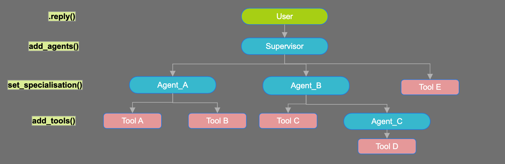

# LMFLow

*A simple, clean python framework for building multi-agent applications powered by your favourite LLMs.*




## Motivation

The motivation to build LMFlow (language-model-flow) is to have a simpler and transparent framework to build LLM based agentic applications, opposed to popular libraries like langchain, llamaindex, etc, which are adding overkill features and complications to support rare use-cases. I am building LMFlow because it was hard to understand what's going on under the hood with the other frameworks and they did not give me the confidence to build production ready applications, with LLMs already being a black box. 

LMFlow is production safe. The core focus here is to keep it light weight and transparent so that using LMFlow actually increases your understanding of LLM systems rather than decreasing it.

## Features
- Use any LLM API or local model easilly.
- Built in conversation manager with multi-conversation support.
- Tools and multi-agent interactions.
- Transparent prompt flow and inter-agent handovers.

## Usage
1. Set up and load key
2. Create your own `ChatLM` class and instance
3. Explore some usefull functions
4. Tools with human in the loop
5. Agents and Multi-agents

## Step-1: Get Your Key
```python
import os
import json

# load the key for your LLM Provider
key = json.load(open("rough/keys.json"))['groq']
```

## Step-2: Make you own ChatLM

```python
from groq import Groq
from lmflow.base import ChatLM

client = Groq(api_key=key)  # LLM Provider

class MyLM(ChatLM):
    def respond(self, prompt):
        response = client.chat.completions.create(
            model='llama3-8b-8192',
            max_tokens=1024,
            temperature=0.1,
            messages=prompt
        )
        return response.choices[0].message.content

lm = MyLM()
lm.reply("How many legs do cats have?")
```
```
>> 'Cats have 4 legs.'
```
### Or just choose from the popular ones builtin

```python
from lmflow.lm import GroqChatLM

lm = GroqChatLM(key, model='llama3-70b-8192', max_tokens=1024, name='MyLM')
lm.reply("How many legs do spiders have?")
```
```
>> 'Spiders have 8 legs.'
```

## Step-3 Some Other Features
```python
# Access and modify the prompt freely, it follows the same structure as OpenAI, Anthropic, etc.
lm.prompt

[
 {'role': 'system', 'content': '\nYou are a helpful assistant. Keep your responses concise.\n'},
 {'role': 'user', 'content': 'How many legs do spiders have?'},
 {'role': 'assistant', 'content': 'Spiders have 8 legs.'}
 {'role': 'user', 'content': ...},
 {'role': 'assistant', 'content': ...}
]

# Append or overwrite the system prompt
lm.instruct("Instruction prompt msg ...", overwrite=False)

# clear chat history
lm.clear_chat()

# clear last exchange (in case of wrong response)
lm.clear_last_interaction() # removes it from lm.prompt

# managed conversations
lm.reply('message ...')  # reply() remembers your past messages and responses, just pass the current msg here
```

## Step-4 Tools

Note:
- The tool function must have a doc string
- It must input and return str or convertible to str objects
- Returning a statement instead of just a value is always better
- use `human=True` for tools that need human confirmation
- use `dont_infer=True` for tools that just execute a task and done return any information needed by the LLM to respond

```python
from lmflow.base import lmtool

@lmtool()
def get_file_size(file_path):
    '''Returns the size of the file at the given path
    param: file_path (str)
    '''
    return f'The size of the file at path {file_path} is {os.path.getsize(file_path)} bytes'

# for tools which may need human confirmation
@lmtool(human=True, dont_infer=True)
def delete_file(file_path):
    '''deletes the file at given file path
    param: file_path
    '''
    os.remove(file_path)
    return f'Deleted file {file_path}'

file_operator_agent = GroqChatLM(key, model='llama3-70b-8192', max_tokens=1024, temperature=0.1, name='file_operator_agent')
file_operator_agent.add_tools([get_file_size, delete_file])
file_operator_agent.reply('Delete the temp.txt file')
```
```
>> Please confirm the following action (Y/N): delete_file ('temp.txt',) {} y
>> Task Completed!
   Deleted file temp.txt
```

## Step-5 Agents and Multi-Agents
A common pattern is to have an agent that interfaces with the user, and directs respective queries to other agents.
- `set_specialisation()`
    - Tells the supervisor when and why to use this agent.
    - It must start with the phrase "This agent specialises in ..."
    - It is required to set_specialisation for an agent to be registered by another ChatLM `add_agents()`
- Each agent can have its own set of tools
- An agent can have more agents too.
- For example, the following code makes this dependency structure
```yaml
supervisor:
    - login()
    - local_timekeeper:
        - get_current_time()
        - get_day()
    - file_system_agent:
        - list_files()
        - change_directory()
        - get_current_directory()
        - file_operator_agent:
            - get_file_size()
            - delete_file()
```
```python
local_timekeeper = GroqChatLM(key, model='llama3-70b-8192', max_tokens=1024, temperature=0.1, name='timekeeper')
local_timekeeper.set_specialisation("This agent specialises in information about current date and time")
local_timekeeper.add_tools([get_current_time, get_day])

file_operator_agent = GroqChatLM(key, model='llama3-70b-8192', max_tokens=1024, temperature=0.1, name='file_operator_agent')
file_operator_agent.set_specialisation("This agent specialises in all modifying and getting details about infividual files")
file_operator_agent.add_tools([get_file_size, delete_file])

file_system_agent = GroqChatLM(key, model='llama3-70b-8192', max_tokens=1024,temperature=0.1, name='file_explorer_agent')
file_system_agent.set_specialisation("This agent specialises in exploring and navigating local directory")
file_system_agent.add_tools([list_files, change_directory, get_current_directory])
file_system_agent.add_agents(file_operator_agent)

supervisor = GroqChatLM(key, model='llama3-70b-8192', max_tokens=1024, temperature=0.1, name='supervisor')
supervisor.add_tools(login)
supervisor.add_agents([local_timekeeper, file_system_agent])

print(supervisor.reply('List files in my current directory'))
```
```console
>> Transfering conversation to agent: "file_explorer_agent"
```
```
>> Here is the list of files in your current directory:

  1. .DS_Store
  2. LICENSE
  3. lmflow
  4. output
  5. README.md
```
```python
print(supervisor.reply('Does my current directory have a README file?'))
```
```
>> Yes, your current directory has a README file.
```
```python
print(supervisor.reply('Change directory to output and list files')) # Does not handle sequence of tasks yet
```
```
>> Task Completed!
   Changed to output
```
```python
print(supervisor.reply('now list files'))
```
```
>> Here is the list of files in your current directory:

   1. output_18-11-2024.csv
   2. output_04-11-2024.csv
   3. output_11-11-2024.csv
   4. output_28-10-2024.csv
```
```python
print(supervisor.reply("what is the size of output_28-10-2024.csv in this directory"))
```
```console
>> Transfering conversation to agent: "file_operator_agent"
```
```
>> The size of output_28-10-2024.csv is 0 bytes.
```
```python
print(supervisor.reply("delete file ending with 28-10-2024.csv"))
```
```
>> Please confirm the following action (Y/N): delete_file ('output_28-10-2024.csv',) {} n
>> Task Completed!
   Task cancelled by user
```
```python
print(supervisor.reply("What date is it?"))
```
```console
>> Transfering conversation back to agent: "file_explorer_agent"
   Transfering conversation back to agent: "supervisor"
   Transfering conversation to agent: "timekeeper"
```
```
>> The date is 11-24-2024.
```
```python
print(supervisor.reply("And what day is this?"))
```
```
>> This is Sunday.
```
